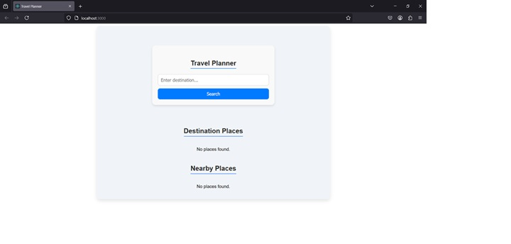
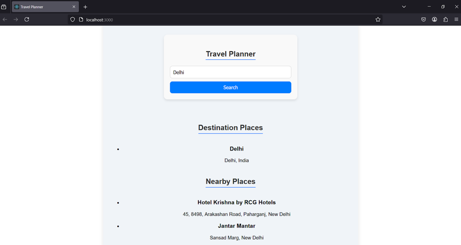
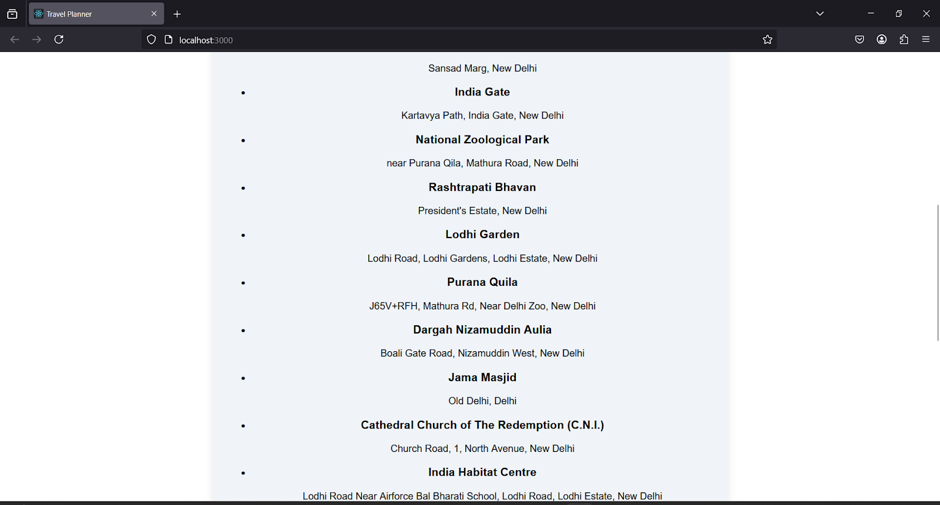
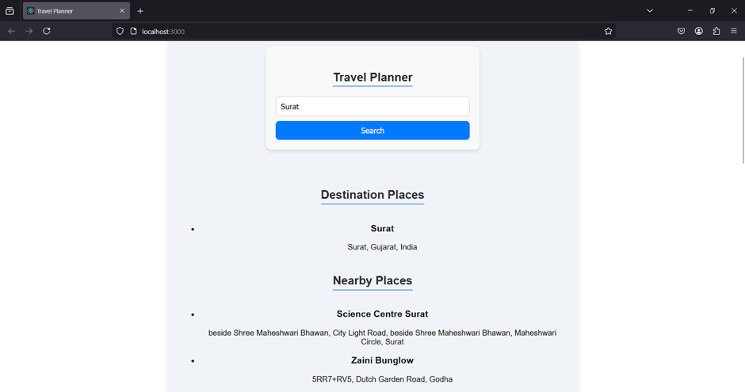
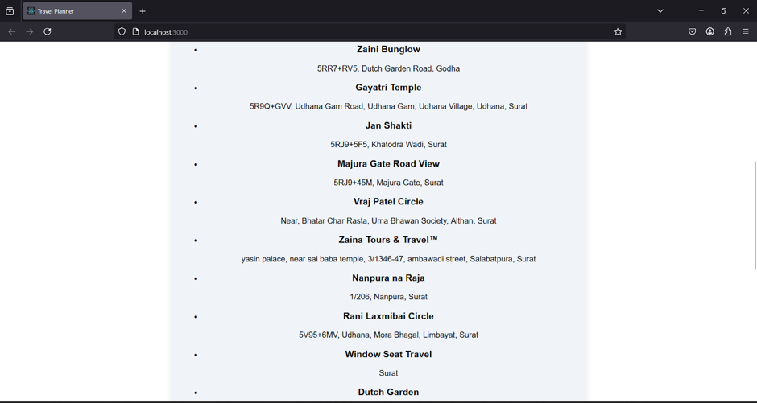
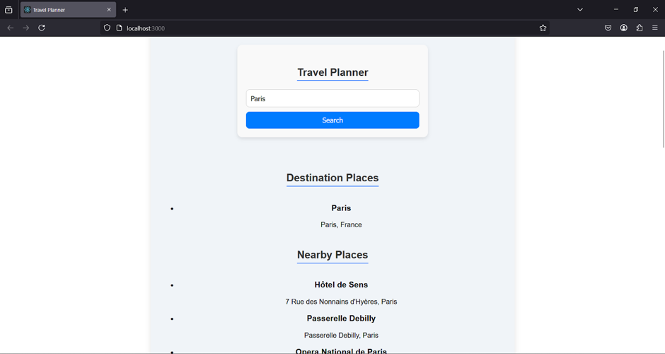

# 🌍 Travel Planner

The **Travel Planner** is a full-stack web application designed to help users plan their trips by searching for destinations and discovering nearby places of interest. It integrates with the **Google Maps API** to provide real-time information on destinations, nearby attractions.

---

## 🚀 Features

- **Search Destinations:** Enter a destination to get detailed information.
- **Nearby Places:** Discover nearby tourist attractions based on your destination.
- **Responsive UI:** A sleek and user-friendly interface built with React.

---
## 📦 Setup and Installation

### **Prerequisites:**
- **Node.js & npm** – To run the React frontend.
- **Golang** – To run the backend server.
- API keys for **Google Maps** services.

### **Clone the Repository:**
- git clone https://github.com/yourusername/travel-planner.git
- cd travel-planner

## 🛠 Technologies Used

### **Frontend:**
- **React.js** – Frontend framework for building the UI.
- **Axios** – For making HTTP requests.
- **CSS** – Styling the application.

### **Backend:**
- **Golang (Go)** – RESTful API for handling requests.
- **Gorilla Mux** – HTTP router for Go.
- **Google Maps API** – To fetch destination and nearby places.

### **Development Tools:**
- **Postman** – For testing APIs.
- **Git & GitHub** – Version control and repository management.

---

## 🏗 Architecture Overview

- **Frontend (React):** Handles user input and displays data.
- **Backend (Golang):** Processes API requests and integrates third-party services.
- **APIs:** Google Maps API for destination data and Currency Exchange API for currency conversion.

---
## 📸 Screenshots

### Home Page

 
